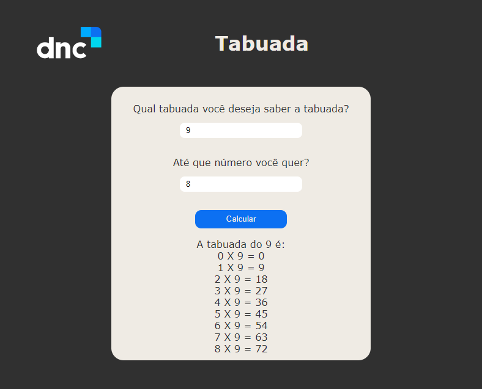

# DNC School

## Escola DNC Ciclo Iniciante
## Recriando Layout

> Formação em Tecnologia

Projeto Tabuada.

> [🔗 Clique aqui para acessar da Page](https://tabuada-dnc-schooll.netlify.app)

# 🧰🛠️ Tecnologias

- HTML
- CSS
- Git e Github
- Variavéis
- Acessibilidade
- WEB
- FIGMA
- Fontes e personalizção
- Function
- JavaScript

# 💛 Contato

sebastiaovitor18@gmail.com

[Linkedin](https://www.linkedin.com/in/sebastião-vitor-7a2870106/)
=======

Nessa etapa aprendemos as funcionalidades do DOM, recriando uma tabuada.

Ansioso para as próximas etapas.
😁bora codar.
